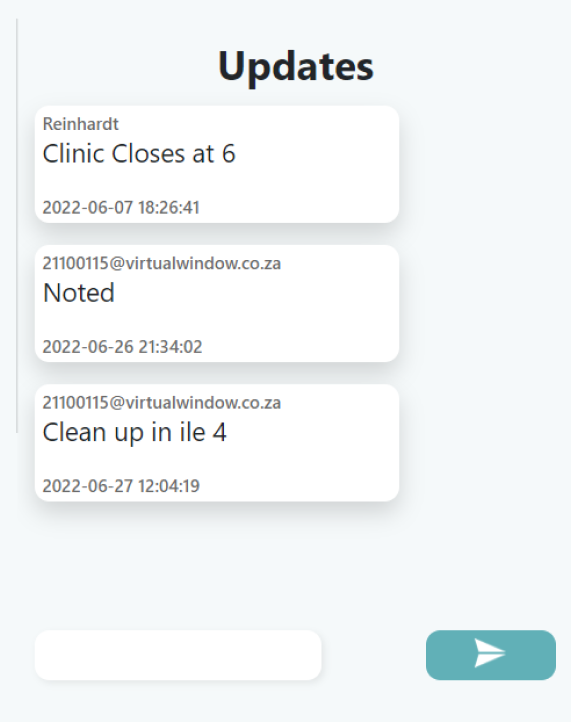
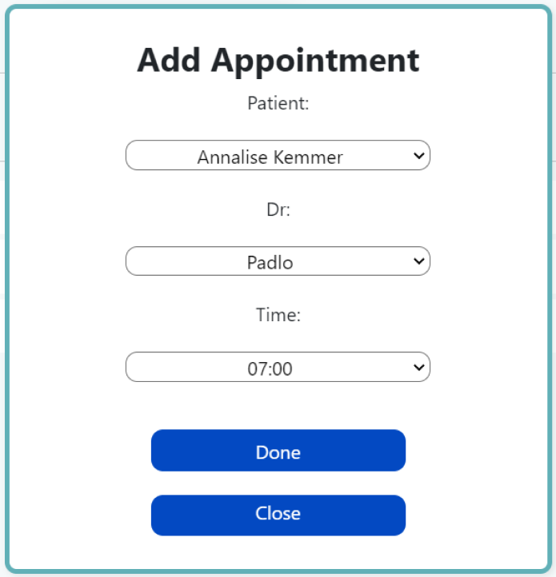
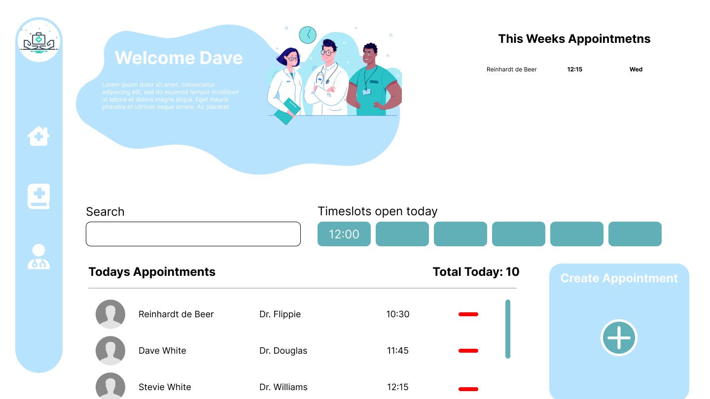
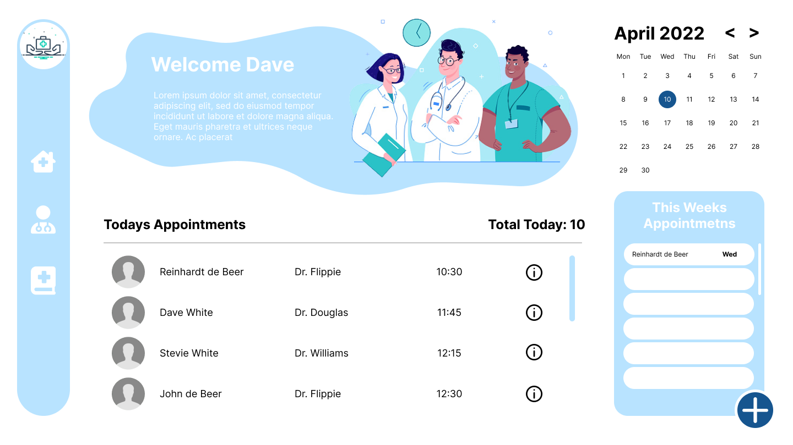
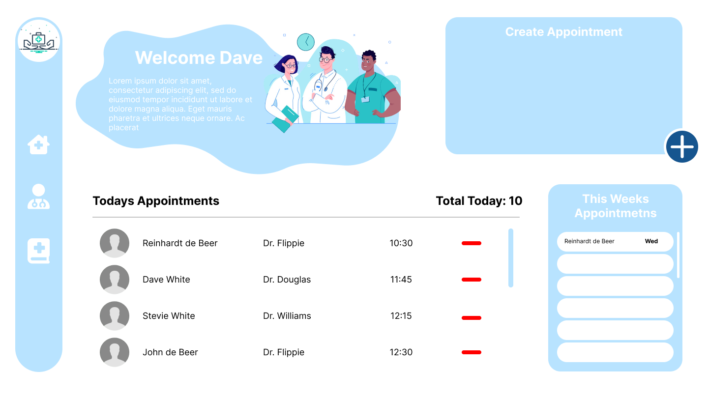
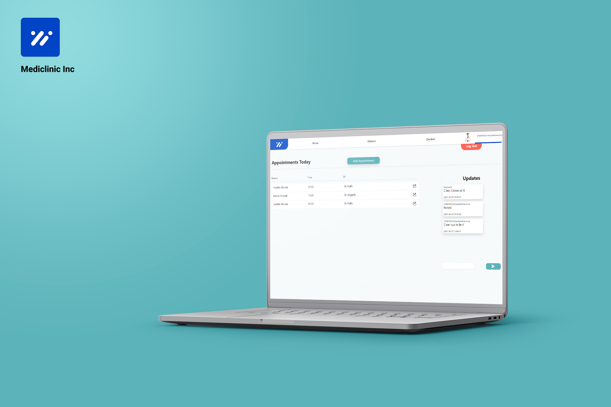
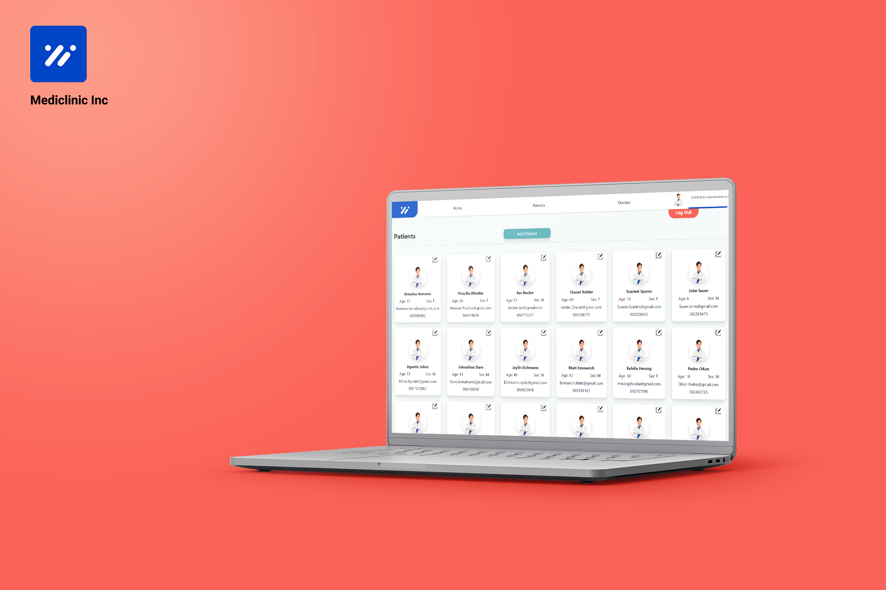
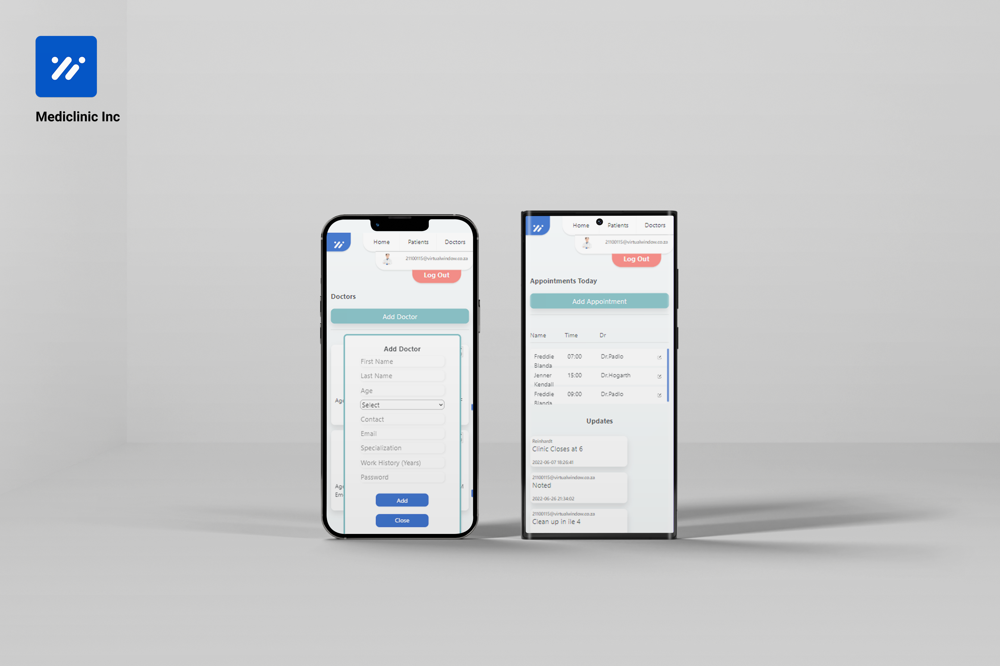

## Repo Info


Reinhardt de Beer
21100115 - DV_200

# Interactive Development 200 Term 2


A management system for mediclinics/receptionists. Add, remove and update Appointments, Patients and Doctors.

## Table of contents

* [Installation](#Installation)
    * [Depebdancy Documentation](#Dependancies-Utilized)
* [Dependancies-Utilized](#Dependancies-Utilized)
* [Features](#Features)
    * [Feature-Screenshots](#Feature-Screenshots)
* [Ideation](#Ideation)
* [Development-Process](#Development-Process)
    * [Challenges](#Challenges)
* [Final-Outcome](#Final-Outcome)
    * [Mockups](#Mockups)
    * [Video-Demonstration](#Video-Demonstration)
    * [Final-Outcome](#Final-Outcome)
* [Authors](#Authors)
* [License](#License)
* [Contact](#Contact)
## Installation

1. GitHub Desktop
Enter `https://github.com/EpicBlue1/MedClinic.git` into the URL field and press the `Clone` button.

2. Clone Repository
Run the following in the command-line to clone the project:
   ```sh
   git clone https://github.com/EpicBlue1/MedClinic.git
   ```
    Open `IDE` and select `File | Open...` from the menu. Select cloned directory and press `Open` button

3. Install Dependencies
Run the following in the command-line to install all the required dependencies:
   ```sh
   npm install
   ```

4. An API key is not required## Dependancies Utilized

## Dependancies Utilized

| Name              | Link                                                                     |
| ----------------- | ------------------------------------------------------------------------ |
| React Documentation |  https://reactjs.org/ |
| Axios               |  https://axios-http.com/docs/intro |
| React Router Dom    |  https://v5.reactrouter.com/web/guides/quick-start |
| Sass     |  https://sass-lang.com/ |


## Features

- An overview of all appointments
- Add and Remove Appointments
- An update section for all users to send and receive updates
- View all Patients, add, remove and edit
- View all Doctors, add, remove and edit

## Feature Screenshots  
#### Update Section


#### Update User Information


#### Update Add and Update Appointments



# Ideation
[Pinterest Board For Concept](https://za.pinterest.com/debeer0072/dv_t2_redesign/)

### Wireframes




## Development Process

* An initial site was developed but was scrapped (the wireframes), and development started over for a more refined design.
* Utilized React `React` dependency for building the project
* Utilized php with `Mamp and MyPhpAdmin` to access and create a database for this web application
* Utilized React `Bootstrap` for responsive design on mobile devices
* Utilized `SCSS` to speed up the development process, with reusable variables, etc.

## Challenges

* Being overly ambitious with my limited knowledge of something new.
* CORS errors, where the problem is exactly and the little time to sort them out.
* Profile images on the database
* Too many PHP files

## Final Outcome

### Mockups






### Mobile




### Promotional Video

[Promotional Video](https://youtu.be/_ifrJrLPCv0)

### Video Demonstration

To see a run through of the application, click below:

[View Demonstration](https://youtu.be/My5EZHe_pUE)

## Authors

* **Reinhardt de Beer** - [EpicBlue1](https://github.com/EpicBlue1)

## License

Distributed under the MIT License. See `LICENSE` for more information.\

## Contact

* **Reinhardt de Beer** - [21100115@virtualwindow.co.za](mailto:21100115@virtualwindow.co.za) - [@rdb_fotopatat](https://www.instagram.com/rdb_fotopatat/) 
* **Project Link** - https://github.com/EpicBlue1/MedClinic